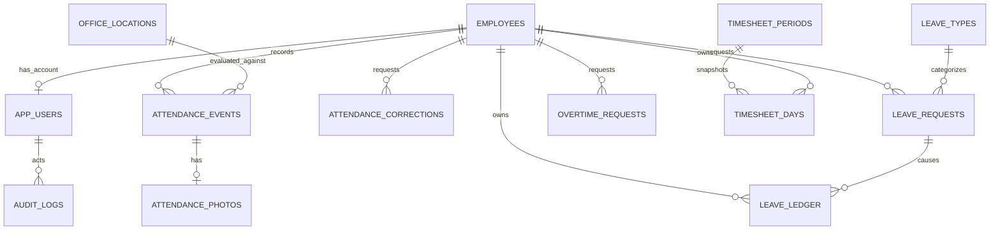

# 02 — Thiết kế dữ liệu hệ thống chấm công Marixa

## 1. Nguyên tắc dữ liệu

Supabase Postgres lưu hồ sơ, sự kiện và metadata; **ảnh chỉ nằm trong Supabase Storage bucket riêng tư**. Dữ liệu công gốc không bị ghi đè khi sửa; điều chỉnh và phê duyệt là record riêng. Mọi thời điểm lưu `timestamptz` UTC, hiển thị và xác định ngày công theo `Asia/Ho_Chi_Minh`. Các bảng có `id uuid`, `created_at`, `updated_at` phù hợp; khóa ngoại và chỉ mục tạo trong migration. Chỉ dùng schema cần thiết cho khối văn phòng Marixa.

## 2. Sơ đồ quan hệ

## 3. Bảng và trường cốt lõi

| Bảng | Trường quan trọng | Ràng buộc / mục đích |
| --- | --- | --- |
| `employees` | `employee_code`, `full_name`, `work_email`, `phone`, `department`, `job_title`, `hire_date`, `status` | `employee_code` và `work_email` duy nhất; hồ sơ không bị xóa khi nghỉ việc. Không đưa lương/CCCD vào V1. |
| `app_users` | `auth_user_id`, `employee_id`, `role`, `status`, `must_change_password` | Khóa ngoại tới Supabase Auth và `employees`; mỗi hồ sơ tối đa một tài khoản; role thuộc `employee/hr/admin`. Cờ bắt đổi mật khẩu khi admin cấp/reset tài khoản. |
| `office_locations` | `name`, `latitude`, `longitude`, `radius_m`, `active` | Admin cấu hình nơi tham chiếu GPS; V1 có thể có một văn phòng, schema cho phép nhiều địa điểm văn phòng về sau. |
| `work_policies` | `effective_from`, `effective_to`, `timezone`, `start_time`, `lunch_start`, `lunch_end`, `end_time`, `working_weekdays`, `late_grace_minutes`, `photo_retention_days` | Một ca chung cho toàn bộ nhân viên, do admin chỉnh qua các phiên bản có ngày hiệu lực và audit. Tạo phiên bản mới phải đóng phiên bản cũ vào ngày liền trước trong cùng giao dịch; mỗi ngày chọn đúng một phiên bản, không có khoảng hiệu lực chồng lấn. Cấu hình mới không sửa snapshot kỳ đã khóa. |
| `holidays` | `date`, `name`, `is_working_override` | Lịch ngày nghỉ/làm bù do admin nhập; ngày duy nhất. |
| `attendance_events` | `employee_id`, `work_date`, `kind`, `occurred_at`, `device_occurred_at`, `received_at`, `source`, `idempotency_key`, `latitude`, `longitude`, `accuracy_m`, `office_location_id`, `office_radius_m_at_capture`, `distance_m`, `location_flag`, `evidence_status`, `review_status` | `kind` là `check_in/check_out`; unique `(employee_id, work_date, kind)` và `idempotency_key`; lưu bán kính đã dùng để kết quả vị trí cũ không đổi khi cấu hình văn phòng đổi. |
| `attendance_photos` | `attendance_event_id`, `storage_path`, `mime_type`, `bytes`, `uploaded_at`, `expires_at`, `deleted_at` | Mỗi event tối đa một ảnh; `storage_path` trỏ bucket private; metadata còn lại sau khi xóa ảnh theo retention. |
| `attendance_corrections` | `employee_id`, `work_date`, `proposed_check_in`, `proposed_check_out`, `reason`, `status`, `reviewer_id`, `reviewed_at`, `review_note` | Yêu cầu và kết quả duyệt; không sửa event gốc. Lưu snapshot dữ liệu đề nghị và dữ liệu trước/sau trong audit. |
| `leave_types` | `code`, `name`, `deducts_annual_balance`, `active` | Admin cấu hình các loại nghỉ. |
| `leave_requests` | `employee_id`, `leave_type_id`, `start_date`, `end_date`, `day_parts`, `total_days`, `reason`, `status`, `version`, `reviewer_id`, `reviewed_at` | `day_parts` mô tả cả ngày/sáng/chiều; số ngày tính theo ngày làm, hỗ trợ bước 0,5 ngày. |
| `leave_ledger` | `employee_id`, `year`, `amount_days`, `entry_type`, `leave_request_id`, `reason`, `created_by` | Số dư = tổng giao dịch; cấp/chuyển/điều chỉnh/trừ/hoàn; giao dịch trừ/hoàn idempotent theo đơn và phiên bản. |
| `overtime_requests` | `employee_id`, `work_date`, `start_at`, `end_at`, `reason`, `status`, `reviewer_id`, `reviewed_at` | Không tính tăng ca trước khi duyệt; không tự lấy toàn bộ khoảng ra muộn. |
| `timesheet_periods` | `year`, `month`, `status`, `reviewed_by`, `reviewed_at`, `locked_by`, `locked_at`, `version` | Unique `(year, month)`; `open/hr_reviewed/locked`; lưu người và thời điểm khóa. |
| `timesheet_days` | `period_id`, `employee_id`, `work_date`, `regular_minutes`, `overtime_minutes`, `leave_days`, `late_minutes`, `early_minutes`, `exceptions`, `source_revision`, `snapshot_version` | Unique `(period_id, employee_id, work_date, snapshot_version)`; snapshot khi khóa, không tính từ dữ liệu mới trên màn hình kỳ đã khóa. |
| `audit_logs` | `actor_user_id`, `action`, `entity_type`, `entity_id`, `before_json`, `after_json`, `reason`, `created_at` | Ghi thay đổi công, duyệt đơn, sổ phép, role, chính sách, kỳ công và xóa ảnh. Chỉ admin xem toàn bộ. |

`work_date` của chấm công được xác định tại thời điểm tạo theo múi giờ công ty. V1 không có ca qua nửa đêm. Ca chung **mặc định khi khởi tạo**: thứ 2–thứ 7, 08:00–12:00 và 13:00–17:00, không có phút miễn trễ; admin có thể thay mọi mốc giờ/ngày làm và số phút miễn trễ bằng phiên bản có ngày hiệu lực. Phép tính, đi trễ/về sớm và nghỉ trưa ngày nghỉ đều dùng phiên bản áp dụng cho ngày đó. Admin phải đặt `photo_retention_days` trước khi mở chấm công; không đặt thời hạn lưu ảnh ngầm.

## 4. Ràng buộc toàn vẹn và ghi nhận offline

- Tạo unique partial index trên `app_users(role)` khi `role = 'admin' AND status = 'active'` để ngăn admin hoạt động thứ hai. Quy trình bootstrap tạo một admin; giao dịch khóa/xóa tài khoản phải từ chối nếu sẽ làm mất admin cuối cùng.
- Chỉ tài khoản `active` và nhân viên `active` được chấm công. Khóa tài khoản giữ nguyên toàn bộ hồ sơ và lịch sử.
- API yêu cầu `idempotency_key` UUID cho mọi lượt chấm; gửi lại cùng khóa trả về cùng kết quả. Khóa unique theo nhân viên/ngày/loại ngăn hai thiết bị ghi hai lượt khác nhau; giao diện hướng dẫn gửi yêu cầu sửa công nếu cần thay mốc.
- Với lượt online, `occurred_at` lấy giờ máy chủ; với lượt offline, lấy giờ thiết bị lúc chụp và đánh dấu `source = offline`, `review_status = needs_review`. Luôn lưu `received_at`; không âm thầm tin giờ thiết bị là tuyệt đối.
- Ảnh có thể tới sau event. `evidence_status = pending/ready/failed/expired`; lỗi upload không xóa event. Kỳ công không khóa nếu còn ảnh đang chờ/lỗi mà chưa được HR ghi nhận kết quả xử lý.
- Phê duyệt đơn, ghi sổ phép và tính lại bảng công phải nằm trong giao dịch nhất quán hoặc hàm database có kiểm soát. Không để hai lượt duyệt song song trừ phép hai lần.
- Khi kỳ đã khóa, không cho mutation thay đổi kết quả kỳ đó; admin mở lại có lý do mới được điều chỉnh và tạo phiên bản snapshot mới.

## 5. Quyền dữ liệu và ảnh

Bật RLS cho mọi bảng nghiệp vụ; policy dựa trên `auth.uid()` và role lưu phía database, không tin role gửi từ client. Nhân viên chỉ đọc hồ sơ, công, đơn, phép, tăng ca và bảng công của mình; chỉ tạo yêu cầu của mình. HR đọc toàn khối văn phòng, sửa hồ sơ cơ bản, duyệt yêu cầu cá nhân của nhân viên/admin và đối soát công; HR không duyệt record có `employee_id` của chính mình. Admin có mọi quyền nghiệp vụ và cấu hình nhưng không duyệt yêu cầu cá nhân của chính mình; admin duyệt yêu cầu của HR. Chặn `UPDATE/DELETE` trực tiếp trên event, ledger, audit và snapshot từ client; thao tác đi qua API/hàm có kiểm tra quyền. Chỉ admin thay role và trạng thái tài khoản.

Bucket `attendance-photos` là private. Đường dẫn ảnh theo `employee_id/yyyy/mm/work_date/event_id.webp`, không chứa họ tên. Nhân viên xem ảnh của mình; HR/admin xem theo quyền. API tạo quyền truy cập ảnh ngắn hạn lúc người dùng mở ảnh; Excel dùng link tới trang chi tiết đã kiểm tra đăng nhập, không nhúng signed URL hết hạn. Xóa ảnh theo retention phải xóa object và đánh dấu metadata, giữ event công và audit.

Xem quy tắc tại [01-business-analysis.md](01-business-analysis.md) và luồng thao tác tại [03-workflow.md](03-workflow.md).
