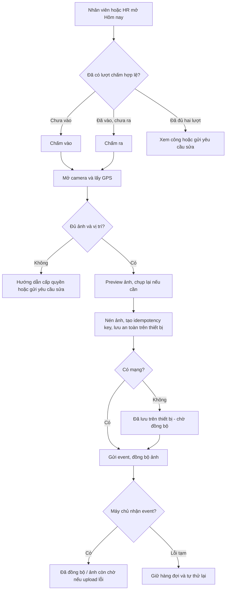
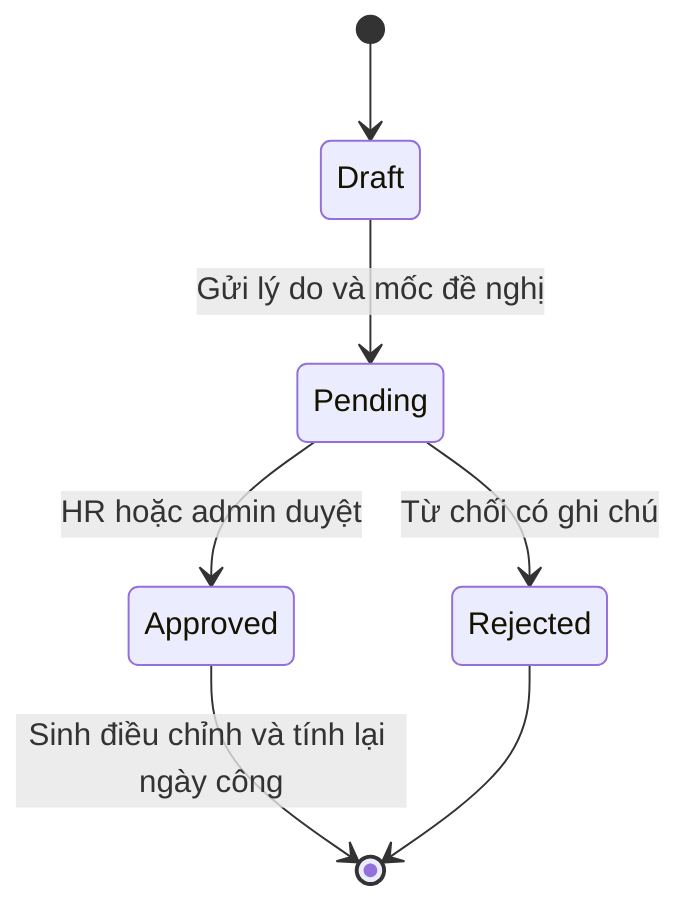
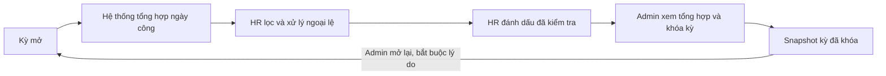

# 03 — Luồng nghiệp vụ hệ thống chấm công Marixa

## 1. Chấm vào và chấm ra

Màn hình chỉ hiển thị nút phù hợp với trạng thái hiện tại. Người dùng chụp ảnh trực tiếp, xem trước và có thể chụp lại. GPS được lấy cùng lúc; không yêu cầu người dùng đọc tọa độ. Vị trí ngoài bán kính văn phòng được ghi nhận với nhãn rõ ràng, không chặn lượt chấm. Mỗi lần chấm có một ảnh riêng.

Trên thiết bị, IndexedDB lưu event, ảnh đã nén, GPS, thời điểm thiết bị và khóa idempotency trước khi thông báo đã lưu offline. Khi mạng trở lại, hàng đợi tự thử lại; lỗi tạm tiếp tục giữ dữ liệu. Nếu server đã nhận event nhưng ảnh chưa lên, trạng thái là **đã ghi nhận lượt chấm, ảnh chờ đồng bộ**. Người dùng không phải chụp lại khi ảnh local còn tồn tại. Nếu dữ liệu trình duyệt bị xóa trước khi đồng bộ, giao diện cần báo rủi ro mất dữ liệu local và hướng dẫn gửi yêu cầu sửa công; không tuyên bố đã đồng bộ khi server chưa xác nhận.

## 2. HR đối soát lượt bất thường

Danh sách HR ưu tiên: thiếu mốc, đi trễ/về sớm, chấm ngoài văn phòng, offline đồng bộ trễ, ảnh chờ/lỗi và GPS độ chính xác thấp. HR mở chi tiết, xem giờ thiết bị/giờ máy chủ, địa điểm dễ hiểu và ảnh qua lightbox; ghi kết quả `đã kiểm tra` hoặc `cần nhân viên bổ sung`. Việc đánh dấu kiểm tra không sửa event gốc. Ảnh lỗi kéo dài phải được xử lý trước khi khóa kỳ hoặc ghi ngoại lệ có lý do để admin thấy khi khóa.

## 3. Yêu cầu sửa công

Người dùng chỉ gửi yêu cầu cho ngày của mình. HR duyệt yêu cầu của nhân viên hoặc admin có hồ sơ nhân viên; admin duyệt của HR. Người duyệt không được là người gửi. Người duyệt thấy event gốc, ảnh, GPS, dữ liệu đề nghị và lý do. Khi duyệt, hệ thống tạo điều chỉnh riêng và audit trước/sau; không ghi đè ảnh hoặc mốc gốc. Nếu kỳ đã khóa, yêu cầu có thể được lưu nhưng không áp dụng vào công cho đến khi admin mở lại kỳ có lý do.

## 4. Đơn nghỉ và sổ phép

Người dùng có hồ sơ nhân viên tạo nháp, chọn loại nghỉ, ngày, cả ngày hoặc nửa ngày, lý do; hệ thống tính số ngày làm tương ứng theo lịch và ngày nghỉ đã cấu hình. Khi gửi, người duyệt là HR nếu người gửi là nhân viên/admin, là admin nếu người gửi là HR. Không cho tự duyệt. Người duyệt có thể duyệt hoặc từ chối kèm ghi chú. Nếu nghỉ phép năm, phê duyệt tạo giao dịch trừ sổ phép đúng một lần; từ chối không trừ. Hủy đơn đã duyệt cần quyền duyệt tương ứng và tạo giao dịch hoàn. Đơn chờ duyệt hiển thị số ngày dự kiến nhưng chưa trừ chính thức. PDF sau khi lưu ghi mã đơn, phiên bản, trạng thái, thông tin người nghỉ, thời gian, lý do và người duyệt; PDF cũ không thay dữ liệu hệ thống.

## 5. Yêu cầu tăng ca

Người dùng nhập ngày, khoảng giờ dự kiến và lý do. HR duyệt cho nhân viên/admin, admin duyệt cho HR; không ai duyệt yêu cầu của chính mình. Sau phê duyệt, bảng công chỉ tính phần giao giữa thời gian tăng ca được duyệt và thời gian chấm thực tế ngoài giờ thường của ca chung có hiệu lực trong ngày. Nếu thiếu chấm ra, tăng ca chưa được chốt cho đến khi sửa công được duyệt. Không tự tính tăng ca chỉ vì chấm ra sau giờ kết thúc ca.

## 6. Chốt kỳ tháng

Kỳ mở có thể tính lại khi có chấm công, đơn hoặc điều chỉnh được duyệt. Trước khi HR đánh dấu đã kiểm tra, các ngoại lệ phải được xử lý hoặc có ghi chú. Admin khóa kỳ sau khi xem tổng hợp và danh sách ngoại lệ còn lại; snapshot gồm công thường, tăng ca, phép và trạng thái từng ngày. Dữ liệu nguồn phát sinh sau khóa không âm thầm đổi báo cáo cũ. Mở lại kỳ tạo audit, tính lại có kiểm soát và tăng phiên bản snapshot. Excel của kỳ mở gắn nhãn bản tạm; Excel kỳ khóa dùng snapshot.

## 7. Trạng thái và lỗi cần hiển thị

| Tình huống | Phản hồi cho người dùng | Xử lý dữ liệu |
| --- | --- | --- |
| Camera/GPS bị từ chối | Chỉ cách cấp quyền và nút gửi yêu cầu sửa công | Không tạo event thiếu bằng chứng |
| Mất mạng sau khi chụp | “Đã lưu trên thiết bị – chờ đồng bộ” | Giữ queue IndexedDB và thử lại |
| Gửi event trùng | “Lượt này đã được ghi nhận” | Trả event cũ theo idempotency, không nhân đôi |
| Event lên, ảnh lỗi | “Đã ghi nhận lượt chấm – ảnh chờ đồng bộ” | Event tồn tại, ảnh tiếp tục retry |
| Chấm ngoài văn phòng | “Đã ghi nhận – HR sẽ kiểm tra vị trí” | Gắn cờ, không tự đánh vắng |
| Thiếu chấm ra | “Ngày công chưa hoàn chỉnh” | Chờ lượt ra hoặc yêu cầu sửa được duyệt |
| Kỳ đã khóa | “Kỳ công đã khóa” | Chặn thay đổi kết quả đến khi admin mở lại |

Chi tiết trường dữ liệu ở [02-database-design.md](02-database-design.md); kịch bản kiểm thử ở [05-testing-strategy.md](05-testing-strategy.md).
