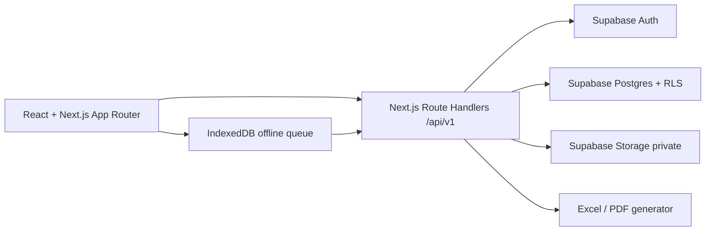

# 04 — Kiến trúc hệ thống chấm công Marixa

## 1. Kiến trúc tổng quan

Ứng dụng dùng TypeScript, React và Next.js App Router, triển khai trên Vercel. Supabase cung cấp Auth email/mật khẩu, Postgres và Storage. Trang có route thật; làm mới, Back/Forward và link chi tiết giữ đúng màn hình. Giao diện nhân viên ưu tiên mobile cho chấm công, giao diện HR/admin ưu tiên desktop nhưng vẫn dùng được trên màn hình nhỏ. Tất cả thao tác nghiệp vụ đi qua lớp service/API có kiểm tra quyền; không cho client ghi trực tiếp bảng công, phép, audit hoặc cấu hình.

**Không dùng Docker trong dự án.** Khi phát triển, chạy Next.js trực tiếp bằng Node.js trên máy và kết nối một Supabase project thử nghiệm riêng trên cloud; bản chính thức kết nối project production. Không tạo Dockerfile/docker-compose, không chạy `supabase start` hoặc Supabase stack cục bộ. [Vercel build Next.js trực tiếp từ mã nguồn](https://vercel.com/i/do-you-need-docker-to-deploy); [Supabase yêu cầu container runtime cho local stack](https://supabase.com/docs/guides/local-development), nên local stack nằm ngoài quy trình của Marixa.

Lựa chọn tích hợp Auth là client Supabase hỗ trợ SSR/cookie theo tài liệu hiện hành; phiên đăng nhập được kiểm tra lại ở server cho mọi route/API có dữ liệu riêng. RLS là lớp chặn ở database, không thay thế kiểm tra nghiệp vụ ở API. Mọi bảng/schema được cấp quyền theo nguyên tắc tối thiểu; service-role key chỉ chạy phía server cho tác vụ quản trị thật sự cần thiết, không đưa vào biến `NEXT_PUBLIC_*` hay mã trình duyệt. Tham khảo [Supabase SSR Auth](https://supabase.com/docs/guides/auth/server-side) và [Supabase RLS](https://supabase.com/docs/guides/database/postgres/row-level-security).

## 2. Phân hệ

| Phân hệ | Trách nhiệm |
| --- | --- |
| Identity & employee | Tài khoản, role, hồ sơ nhân viên, trạng thái làm việc; HR sửa hồ sơ cơ bản, admin cấp quyền. |
| Attendance | Nhận sự kiện chấm công idempotent, ảnh/GPS, trạng thái đồng bộ, kiểm tra ngoài văn phòng và yêu cầu sửa. |
| Leave & overtime | Đơn, duyệt đúng người, sổ phép, PDF đơn nghỉ, tăng ca được duyệt. |
| Timesheet | Tính công/nghỉ/tăng ca theo ngày, đối soát ngoại lệ, snapshot và khóa kỳ. |
| Reports | Dashboard theo quyền, Excel bảng công, link ảnh qua trang kiểm tra session. |
| Admin settings & audit | Quản lý một ca chung có ngày hiệu lực (giờ làm, nghỉ trưa, ngày làm, miễn trừ đi trễ), ngày nghỉ, địa điểm, retention, role và nhật ký thay đổi. |

Tính công nằm trong một service/domain duy nhất để UI, Excel và dashboard không cho ra ba kết quả khác nhau. Hàm tính nhận chính sách có hiệu lực vào ngày công, sự kiện chấm, nghỉ đã duyệt, tăng ca đã duyệt và điều chỉnh; trả kết quả ngày cùng danh sách ngoại lệ. Kỳ đã khóa lấy snapshot thay vì tính lại từ dữ liệu sống.

## 3. Route giao diện

| Route | Người dùng | Nội dung |
| --- | --- | --- |
| `/login`, `/password-help` | Chưa đăng nhập | Đăng nhập và hướng dẫn liên hệ admin để đặt lại mật khẩu trong V1 Free. |
| `/change-password` | Tài khoản vừa được cấp/reset | Buộc đổi mật khẩu tạm trước khi vào các trang nghiệp vụ. |
| `/today` | Mọi tài khoản có hồ sơ | Chấm vào/ra, trạng thái hôm nay, queue offline. |
| `/my-attendance`, `/my-requests`, `/my-profile` | Nhân viên, HR, admin có hồ sơ | Lịch sử công, đơn/nghỉ/tăng ca/sửa công, hồ sơ cá nhân. |
| `/hr/dashboard`, `/hr/employees`, `/hr/attendance` | HR, admin | Tổng quan, hồ sơ, đối soát công và ảnh. |
| `/hr/requests`, `/hr/timesheets`, `/hr/reports` | HR, admin | Duyệt, kỳ công và báo cáo/Excel. HR không thấy nút duyệt yêu cầu của mình. |
| `/admin/settings`, `/admin/settings/shifts`, `/admin/accounts`, `/admin/audit` | Admin | Cấu hình; màn hình riêng xem và chỉnh ca chung theo ngày hiệu lực; tài khoản/role; nhật ký. |

Các bộ lọc quan trọng ở trang HR nằm trong query string; trang chi tiết dùng URL riêng. Phân quyền route kiểm tra ở server và API; ẩn menu chỉ là hỗ trợ giao diện.

## 4. Hợp đồng API V1

API trả lỗi có mã máy đọc được (`code`), thông báo tiếng Việt (`message`) và `request_id`; lỗi validation có chi tiết trường. Tất cả mutation cần CSRF/session protection phù hợp với Auth cookie và kiểm tra role phía server. Danh sách phân trang, lọc theo ngày/phòng ban/trạng thái, giới hạn số hàng trên mỗi lần gọi.

| Endpoint | Chức năng / quyền |
| --- | --- |
| `GET /api/v1/me`, `GET /api/v1/me/attendance` | Hồ sơ và công của chính mình. |
| `POST /api/v1/me/change-password` | Đổi mật khẩu tài khoản đang đăng nhập, bỏ cờ `must_change_password` khi thành công. |
| `POST /api/v1/attendance/events` | Chấm vào/ra; body gồm `kind`, thời điểm thiết bị, GPS, `idempotency_key`; server xác định nhân viên từ session. |
| `POST /api/v1/attendance/events/{id}/photo` | Tải ảnh nén cho event của mình; event giữ `photo_pending` nếu upload lỗi. |
| `GET /api/v1/attendance/events/{id}/photo` | Cấp quyền xem ảnh private cho chủ sở hữu, HR, admin. |
| `POST /api/v1/attendance/corrections`, `GET /api/v1/attendance/corrections` | Gửi/xem yêu cầu sửa của mình. |
| `POST /api/v1/leave-requests`, `POST /api/v1/overtime-requests` | Tạo đơn của mình. |
| `POST /api/v1/requests/{type}/{id}/decision` | Duyệt/từ chối; HR cho nhân viên/admin có hồ sơ, admin cho HR; chặn tự duyệt. |
| `GET /api/v1/hr/attendance`, `GET /api/v1/hr/employees`, `GET /api/v1/hr/reports` | HR/admin xem toàn khối; lọc/phân trang. |
| `POST /api/v1/hr/employees`, `PATCH /api/v1/hr/employees/{id}` | HR/admin tạo và cập nhật hồ sơ cơ bản; thay đổi được audit. |
| `POST /api/v1/hr/timesheet-periods/{id}/review` | HR đánh dấu đã kiểm tra sau khi xử lý ngoại lệ. |
| `POST /api/v1/admin/accounts`, `PATCH /api/v1/admin/accounts/{id}` | Admin cấp/khóa tài khoản và gán một trong ba role; chặn admin thứ hai. |
| `POST /api/v1/admin/timesheet-periods/{id}/lock`, `.../unlock` | Admin khóa/mở lại với lý do và audit. |
| `POST /api/v1/admin/accounts/{id}/reset-password` | Admin đặt mật khẩu tạm mới, bật cờ bắt đổi và ghi audit; tác vụ Auth Admin API chỉ chạy ở server. |
| `GET /api/v1/reports/timesheet.xlsx`, `GET /api/v1/leave-requests/{id}.pdf` | Xuất theo quyền, trạng thái và phiên bản. |

API chấm công từ offline gửi `idempotency_key` cũ khi retry. Nếu khóa này đã xử lý, trả cùng event. Nếu đã tồn tại lượt chấm cùng người/ngày/loại từ thiết bị khác, trả lỗi xung đột có hướng dẫn yêu cầu sửa, không ghi đè. Ảnh phải thuộc event của chính user; server kiểm tra MIME, kích thước và quyền. Upload ảnh không quyết định việc event gốc có tồn tại hay không.

## 5. Offline và thời gian

Client có module queue IndexedDB riêng, lưu payload tối thiểu cùng ảnh đã nén; đồng bộ khi mở ứng dụng và khi trình duyệt báo có mạng. Không hứa background sync khi trình duyệt đã bị hệ điều hành đóng hoàn toàn. Trạng thái queue: `local_only`, `event_synced_photo_pending`, `synced`, `retry_error`, `requires_attention`. Mỗi lần retry dùng cùng khóa idempotency; backoff có giới hạn và nút thử lại. Trước khi người dùng đăng xuất, nếu còn dữ liệu local, hiển thị cảnh báo rõ. Dữ liệu local không được dùng để xuất Excel hay khóa kỳ.

Server lưu ba mốc khi cần: giờ thiết bị, giờ nhận và giờ nghiệp vụ. Online dùng giờ server; offline dùng giờ thiết bị có cờ cần đối soát. Ngày công xác định theo `Asia/Ho_Chi_Minh`, không theo múi giờ của Vercel. Mốc online và offline đều có tọa độ, độ chính xác và trạng thái khoảng cách văn phòng; dữ liệu GPS thô chỉ hiển thị ở trang chi tiết có quyền.

## 6. Quan sát và hiệu năng

Ghi log có `request_id`, mã lỗi, độ trễ và ID sự kiện, không ghi ảnh, mật khẩu hay GPS thô vào log. Theo dõi số queue lỗi, ảnh chờ, lượt chấm xung đột, dung lượng Storage và DB. Trang HR chỉ tải thumbnail/kích thước nhỏ khi cần, ảnh đầy đủ mở riêng; bảng phân trang. API xuất Excel chạy theo tháng và phạm vi dưới 15 người; nếu request quá thời hạn chức năng Vercel thì chia nhỏ hoặc đổi chiến lược xuất ở phiên sau.

Chi tiết dữ liệu ở [02-database-design.md](02-database-design.md), giao diện ở [07-ui-design-system.md](07-ui-design-system.md).
